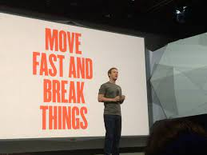

## Preamble

I agree with most of the thinking out there in the software developer world.

I agree that CI/CD is good, that static types are useful, that code should be easy to read, and a host of other things that almost everyone agrees with.

But I thought it would be fun to write down a few ideas of mine that go against the grain. These ideas aren't rare, or original to me, but they definitely feel like minority opinions.

I'm sharing these for two reasons:

1. I want to come back to this in a year or two and see if I've changed my mind.
2. I hope others who agree with me stumble upon this blog and feel less alone.

Also, I should quickly say that nothing I'm writing here is directed at anyone in particular. I'm not responding to the latest Twitter drama. These are general thoughts about what I read on Reddit, Twitter, Hacker News, etc.

## Single letter variable names are great

Let's start off light. I don't think single letter variable names are bad. I think they are great. A single letter variable name communicates so much!

Look at the variable name in the map function.

```js
// items
items.map((item) => item.name)
// i
items.map((i) => i.name)
```

A single letter variable name communicates that the life of the variable is short and that the contents of the variable are not surprising.

So, when a variable is used only briefly, and its usage is obvious, consider using a single letter variable. It communicates to the reader that this variable isn't noteworthy.

Single letter variable names are common in Go. That's where I learned to love them.

This is an example of a **bad** use of a single letter variable name:

```js
// this is bad code

const r = parseCountry(country)
if (r.location.isValid()) {
  r.stamp(now())
}

// ...10 more lines...

r.name = r.name + "validated"
```

This is bad because r is clearly an important variable. It lives a long time and does a lot. It deserves a longer name!

## Work life balance isn't always a good thing

This is a little spicier. 🌶️

I like working a regular schedule. I'm married, and I have kids. It's great that my kids see me a lot. I'm there for them. I like this a lot. This is good for me, a 40 something year old dad.

But, I don't think a company that optimizes for employees to never work outside of 9-5 is doing itself any favours.

What's good for me isn't automatically good for the company I work for, _and_ what's good for me isn't automatically good for an ambitious 20 year developer.

The common refrain I hear is that companies should keep regular hours so that their workers don't burn out. Burn out will lead to less productivity and workers will start to leave. But maybe that's not true. There's nothing magical about a 40 hour work week. Many countries around the world have longer work weeks. There are plenty of people who would be more productive at 50 hours per week than they would be at 40 hours per week, and smart companies should want to hire these types of people.

If an employee says that working more than 40 hours a week will cause them to burn out, then the company should consider if they want to replace that employee with another employee who can put in a few more hours without burning out.

It's also possible that employees will leave a company where work life balance is prioritized because the culture is not exciting. I can certainly imagine a younger version of myself feeling that way.


Consider a 23 year old software developer who has very few obligations outside of work. All they want to do is become a better software developer. Would working 60 hours weeks for a few years be bad for them, or would they look back on those years as foundational?

To a person, every software developer I look up to has, at some point, worked far more than 40 hours a week. They were obsessed with getting work done and getting better as a developer. These are the kinds of people who make a company grow.

I want to reiterate that I, right now, am not interested in working weekends. But me not liking something doesn't mean it would be bad for the company. As it stands, I spend a lot of my (very limited) leisure time working on side projects. I enjoy doing it, but I also think putting in more than 40 hours per week of work is making me a better developer than I would be if I clocked out on Friday and didn't write a line of code until Monday.

## Speed is greatly undervalued

Speed has gotten a bad reputation over the past decade. "Move fast and break things", a slogan that used to be celebrated, is now commonly mocked. But I think we've swung too far in the opposite direction.



How long does it take you to...

1. Open your code editor to a given line?
2. Make a pull request for a simple change?
3. Get a change into production?
4. Prototype a new feature?

I think the answer we should all aspire to for any of these questions is "not long!" Speed has a quality all of its own.

If you can get to a line of code in 3 seconds, you're much more likely to pull up the code than you would be if it took 30 seconds.

If you can make a simple pull request in under a minute, you'll spend less time organizing work to do, and more time just doing the work.

If your CI/CD pipeline allows for changes to be live in 10 minutes, you'll be less afraid of introducing a small bug.

If you can prototype a feature in two days, why not do that before having two days of meetings on the feature?

The ability to move fast means the ability to try things, see if they work, and then make the required changes. Agile only works if people can move quickly. The slower you move, the more time you have to spend planning, because every step costs so much.

As an example, I'm relatively slow at implementing UIs. So, when I need to implement a UI, I spend a lot of time thinking about every step. But if I was faster at implementing UIs, I'd have the a working prototype to poke around at. Even if it was obviously broken, I wouldn't care because I could make changes to fix it. So, it's to my advantage to get faster at implementing UIs.

On the other hand, I'm fast at making back end changes. This isn't an accident. I've spent time optimizing workflows. Because I can make a change so quickly, I don't get bogged down in planning.

I'm not saying we shouldn't plan, but planning is a necessary evil. Planning isn't an outcome.

## Outcomes are undervalued

So much of what software developers seem to spend their time doing (or at least what they complain about having to do) does not provide value directly.


Here are a list of tasks that software developers spend their time on. I've **bolded** any task that directly provides value.

1. **Creating software**.
2. Discussing their work (daily stand up).
3. Discussing their performance (performance reviews).
4. Discussing their team (retro).
5. Discussing their company (all hands meetings).
6. Planning for upcoming work.
7. Reviewing completed work.

Makes for a full week!

I'm not breaking ground pointing out that a lot of the work a software developer does can feel peripheral, but I do want to make it clear that a software developer can spend their whole week working and not provide any value to their company.

In fact, I'll go a step further and say that without careful attention, software teams will end up spending most of their time on work that does not directly provide value.

I'm not saying a team should never have retros, or that a daily stand up is automatically a bad thing. Allow me to reframe.

### Thought experiment one

Imagine you are on a small team that is competing against another small team. Your team gives equal time to all the tasks above. The other team focuses on creating software, to the exclusion of the other tasks above. After 6 months, which team do you think will have provided more value? If you knew your competitor was pushing hard every day to ship software, how would you feel about spending 3 hours planning a feature that you might never implement?

The situation seems absurd, but it seems incredibly common. Teams spend so much time on communication and "doing software" and they forget to actually create software.

### Thought experiment two

Imagine your team is competing against another team. Your team dedicates time to plan in detail. You devote time for team retros. You have a well-maintained JIRA board. The other team doesn't plan. They just write code. They don't use JIRA opting to instead just sit in a group chat. They don't do PR reviews. They merge their own PRs.

If after 6 months, the other team has out performed your team, what value was there in your ceremonies?

You don't ship your planning documents or your OKRs.

## Knowing how your tools work matters

In the first few years of my software development career, I switched between editors several times. I used Sublime Text, JetBrains, Vim, and VSCode. I would compare the editors based on their features. "This one is fast, but this one let's me rename files easier. Oh, but this one is pretty!" But during this time, I had no clue what a text buffer was. When I installed Prettier, I had no idea what was happening. I didn't know what Prettier was, where it lived, or how it worked. I just knew it formatted my code.

I was equally clueless about the difference between a terminal and a shell, or why some commands could be run from any directory while others couldn't.

I was OK with my tools, but I didn't know how they worked.


I didn't like not knowing how anything actually worked. It made it so hard to fix things when they broke. So, I spent years understanding how things work. I ran Arch Linux (this taught me so much). I switched to Vim full time. I configured ZSH myself. I wrote games in the terminal to see how escape codes work. I used a CLI SQL client.

None of the tools I just mentioned were easy. Many absolutely caused me headaches. But I learned a ton from them. I'm not afraid of my tools.

When I see a developer write about how they could never switch away from JetBrains because "it just works", I get it. They are using great software and it's very comfortable. But if that's all they've ever used, I can't help but feel they are being held hostage.

Similarly, my time on Arch has taught me not to be afraid of upgrades. Yes, things will break. But when they do break, I'll learn something new. It won't stay broken forever.

Knowing how things works sets you free.

## 10x Engineers exist

There's this idea floating around that 10x engineers don't exist, or that 10x engineers are just developers who make everyone else better.

But 10x engineers do exist.

I've worked with developers who were much faster than me. Part of it was natural ability, but they'd also gotten good with their tools. I've also worked with developers who were not as fast as me.


What makes a 10x engineer?

1. They are good with their tools.
2. They are confident (they need to be to move quickly).
3. They have innate ability (some people are born faster than others).
4. They don't waste time.

I'm not saying we all need to try to be 10x engineers (would that I could be one), or that speed is the only thing that matters. But it's useful to know that there are people out there who could build something far more quickly than you, if only because it's humbling to keep it in mind.
