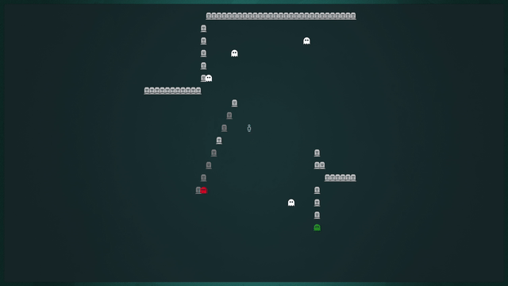
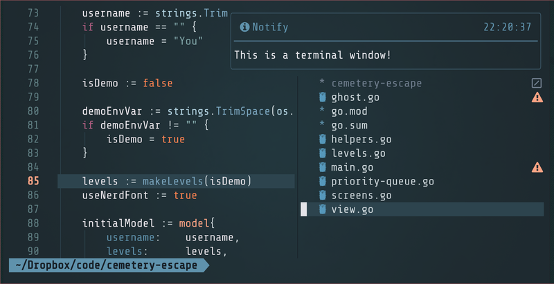

## Overview

[Cemetery Escape](https://github.com/tom-on-the-internet/cemetery-escape) is the most fun terminal game I've created.

You run through the cemetery, avoiding ghosts and searching tombstones for the key that unlocks the next level.

📹 I made a [YouTube video](https://www.youtube.com/watch?v=yZA1JmwQwYE) about the game if that's your thing.



## First, why don't you play the game?

I'm about to walk you through the interesting aspects of creating this game. But if you don't care about the challenges of making a terminal game, I still encourage you to try it out.

If you have an update to date version of Go, you can install the game:

```sh
go install github.com/tom-on-the-internet/cemetery-escape@latest
```

If you prefer to download the binary, you can look in the [releases](https://github.com/tom-on-the-internet/cemetery-escape/releases/latest) for a binary that runs on your hardware.

## Limitations of the terminal

1. You are limited to one character per cell. A cell can have an "A" or an "┌", but never both and never overlapping.
2. There aren't very many cells to work with. Maybe 400. Probably fewer. And the number will vary greatly depending on the user.
3. It's not possible to inspect what has been rendered. It's not like the DOM where you can query to see the current state.
4. There is no "keyup" event. You can react to a key being pressed, but you have no way of knowing if the key is being held down.
5. The output will look different depending on the font, colorscheme, or terminal.

And yet, the best terminal applications make you forget you are using the terminal at all.



## Overcoming the limitations

To overcome the fact that the UI will look different for most users, I encourage the use of a [nerd font](https://www.nerdfonts.com/) so that I have access to great icons. But I also provide a fallback to basic ascii characters.

Instead of limiting the game to the size of the terminal, I use a view port and only show part of the playing area at a time. This means I could have huge maps, even if only a small area if visible at one time.

Because there's no "keyup" event, I have a key press start moving the player in a direction and they only stop when pressing another key. So, no more worrying about key repeat rates.

As for rendering, I'm using [Bubble Tea](https://github.com/charmbracelet/bubbletea) which allows me to keep my state and rendering nicely separated.

## What I'm proudest of

The game features a red ghost I call a "hunter". It uses a path finding algorithm \([A\*](https://en.wikipedia.org/wiki/A*_search_algorithm)\) to find its way around obstacles towards the player. I implemented a basic (bad!) priority queue to facilitate this. As a web developer, I don't often get to use these types of algorithms, so this was fun.

I'm also proud of my level editor. It allows me to take some text and generate a level. It makes designing levels much easier. Speaking of levels, I tried to have some logic to the level layouts so the player would slowly learn how the game works.

<aside>A basic level in the editor</aside>

```txt
		"                      D                     ",
		"                                            ",
		"                          S          K  S   ",
		"                          S             S   ",
		"              H           SSSSSSSSSSSSSSS   ",
		"                                            ",
		"                                            ",
		"                                            ",
		"                      P                     ",
		"                                            ",

```

I'm also glad I finally go to use a [string builder](https://www.calhoun.io/concatenating-and-building-strings-in-go/). Again, because I'm a web developer, I usually don't run into allocations being an issue. But here, re-rendering every 10ms, too many allocations actually had performance impacts.

## Final thoughts

Don't make games in the terminal. It's the wrong medium!
